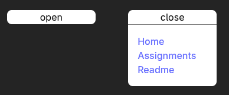

# Uke 3 - Oppgaver

Denne uken har vi noen oppgaver som handler om hvordan vi kan bruke states i React med de forskjellige verktøyene som er tilgjengelig for oss. Hovedsakelig fokuserer oppgavene på bruk av [useState](https://react.dev/reference/react/useState), men du kan møte på situasjoner hvor du trenger [useRef](https://react.dev/reference/react/useRef). Du vill også ha bruk for kunnskaper fra forrige uke for å kunne lage komponenter og bruke props, hvis du føler deg usikker på det kan du lese opp igjen [her](https://github.com/Fontenehuset-Bergen/react-workshop/blob/main/docs/2_components/README.md) eller gå til [react docs om UI](https://react.dev/learn/describing-the-ui).

Oppgavene skal løses ved at du lager din egen branch og lagrer komponenter i henhold til oppgave teksten, hvis oppgaven krever flere komponenter for løsning vill det være skrevet. Du kan lagre løsningene i følgende [mappe](../../src/components/assignment/) for å unngå oppsamling av komponenter i f.eks UI mappen

```console
src/components/assignment
```

Du kan lage din egen branch ved å kjøre følgende kommando i terminalen, eller manuelt via GUI i stackblitz eller ditt IDE. Hvis du bruker kommandoen må du huske å bytte ut `*ditt navn*`

```console
git checkout -b week-3-assignment-*ditt navn* origin/main
```

## Easy

#### Teller komponent

I denne oppgaven ønsker jeg at du skal lage et komponent med funksjonalitet for å styre et tall, komponentet trenger ikke props, men skal inneholde følgende funksjonalitet:

- en `<p>` tag som viser tallet
- 3x knapper for følgende: øke med en, trekke fra med en og tilbakestille tallet til 0
- du velger selv om du vill kalle funksjoner eller bruke inline arrow funksjoner.

#### Dropdown menu

State blir veldig ofte brukt til å styre conditional rendering (når elementer skal vises), så i denne oppgaven skal vi gjøre akkurat dette. Her skal du lage en dropdown meny som har følgende krav

- Komponentet skal motta følgende props: `label: string, href: string` for å produsere `<a>` linker
- I lukket state skal du kun se en knapp for å åpne elementet som bruker `onClick` eventen.
- I åpen state skal komponentet vise linkene under knappen.

Komponentet skal se slik ut når det er lukket og åpent, du kan forbedre styling hvis du ønsker det.



#### Fin feilene

Det er veldig lett å gjøre feil når vi skal behandle state, i denne oppgaven ønsker jeg at dere skal finne de 4 feilene i komponentet og rette dem slik at funksjonaliteten er slik som kommentarene i komponentet beskriver.
Her kan det være smart å lese på ukens dokumentasjon for [state](./2_state_in_react.md) og [vanlige feil](./4_pitfalls.md). Du kan finne lokasjon til komponentet under, eller følge denne [linken](../../src/components/assignment/SpotTheError.tsx)

```console
src/components/assignment/SpotTheError.tsx
```

Du vet at komponentet fungerer når typescript ikke lengre gir feilmeldinger og du kan bruke det i `src/pages/Home.tsx` uten at nettsiden kræsjer når du kjører applikasjonen vår.

## Medium

#### Input tilbakemeldinger

Veldig ofte må vi gi tilbakemeldinger til brukerene hvis de gjør noe vi ikke ønsker på nettsiden. Hvis vi for eksempel bare ønsker at brukernavn skal være mellom 4 og 32 karakterer lang, så bør brukerene bli informert om dette når de bruker input feltet. I denne oppgaven vill jeg at dere skal lage et komponent som har følgende HTML struktur

```tsx
<div>
  <h1>Username</h1>
  <p>Please enter your desired username thats between 4 and 32 characters</p>
  <input type="text" />
  <small style={{ color: "red" }}>*error message*</small>
  <button>Submit</button>
</div>
```

Feilmeldinger skal være som følgende

- For kort: "Your username needs to be longer"
- For langt: "Your username needs to be shorter"

Komponentet skal ha følgende funksjonalitet

- Vise feilmelding avhengig av `conditions`
- Knappen skal være `disabled` hvis input ikke er tillatt

PS. Husk å pass på mellomrom!

#### Todo liste

Ofte trenger vi å jobbe med mer avanserte datatyper enn `string`, `number` eller `booleans`, her må vi huske å være forsiktig med mutering og stale states. I denne oppgaven skal dere lage et komponent for å vise en todo-liste som har følgende funksjonalitet

- Hver todo skal vises på en linje og ha en knapp for å fjerne det elementet fra todo-listen
- Et input felt for å ligge til nye todos
- Det skal ikke være mulig å ligge til tomme eller identiske todo i listen. f.eks skal du ikke kunnne ligge til `kjøp melk` hvis `kjøp melk` allerede eksisterer.
- _Bonus_: vis feilmeldinger under input feltet i rød tekst.
- _Bonus_: Kan du gjøre todo (tekst + knapp) om til et komponent for å løfte state?

#### Form components

Hvis du har for mange input felter i et komponent som behøver sin egen `useState` kan komponentet fort bli unødvendig stort/treigt, da er det ofte bedre at vi slår flere states sammen. I denne oppgaven skal dere lage et komponent for å ta inn følgende inputs og lagre dem i en enkelt state.

- `firstName` - mellom 3 og 50 bokstaver
- `lastName` - mellom 3 og 50 bokstaver
- `userName` - mellom 3 og 16 bokstaver
- `email` - må inneholde @, **bonus**: kan du lage bedre validering?

Hvert input felt skal ha en label og beskrivelse. Komponentet skal også ha en `<button>` som er disablet fram til alle feltene er gyldig utfylt.

## Hard

> [!NOTE]  
> I disse oppgavene går vi litt utover hva vi har lært i undervisning og dere må mest sannsynlig lese litt på react docs eller google litt for å finne svar.

#### State as prop

Når vi løfter state opp er det viktig at vi sender riktige props til komponenter for å bruke state riktig. I denne oppgaven skal du lage to komponenter. Først skal du lage et tekst input komponent som mottar følgende props og kan brukes i andre komponenter med `useState`. Her har jeg skrevet nødvendig typescript informasjon som dere kan bruke for å definere props komponentet skal motta. Du kan kalle komponentet `TextInput` og lagre det i `components/ui/input/` mappen hvis du har laget den

```ts
interface TextInputProps {
  label: string;
  value: string;
  onChange: ChangeEventHandler<HTMLInputElement>;
}
```

Det andre komponentet dere skal lage skal inneholde states og bruke `textInput` istedet for bare `<input />`, her er den største utfordringer å sende riktige props!

#### State persistance

Når vi bruker `useState` og `useRef` i React kan disse elementene miste sin state når de unmounter (bytter side/reloader siden), det vill si at de starter på nytt med initial data når de blir brukt igjen. Vi kan heldigvis lagre state i nettleseren ved å bruke `localStorage` slik at den kan bli hentet neste gang komponentet blir brukt. Dette kalles persistance.

I denne oppgaven ønsker jeg at du lager en kopi av `TodoList` komponentet du lagde tidligere, men her kan du bruke `localStorage` til å se om det eksisterer todo-liste data i nettleseren til brukeren.

Denne oppgaven krever at du leser litt om [useEffect](https://react.dev/reference/react/useEffect) og localStorage ([w3schools](https://www.w3schools.com/jsref/prop_win_localstorage.asp) / [mdn](https://developer.mozilla.org/en-US/docs/Web/API/Window/localStorage))

#### Generating required inputs

Når du har forms med veldig mange inputs kan det fort bli vanskelig å lage HTML kode for alle elementene du trenger, heldigvis har React muligheten til å generere elementer for oss ut i fra dataset.
I denne oppgaven ønsker jeg at du skal bruke følgende objekt til å samle all state, for så å generere nødvendige input elementer ut i fra objektet sine nøkkler. Her er følgende felter form skal inneholde:

```ts
interface ContactDetails {
  firstName: string;
  lastName: string;
  adress: string;
  city: string;
  postCode: number;
  country: string;
  phone: number;
  email: string;
}
```

I React kan vi generere html elementer ut i fra dataset, en metode er `Object.keys()` som generere en array fra alle nøkler i et objekt.

```tsx
{Object.keys(contactDetails).map((keyName) => (
  <input key={keyName} ... />
))}
```

## Bonus (optional)

> [!NOTE]  
> Disse oppgavene er veldig krevende og dere må mest sannsynlig finne informasjon på egenhånd eller spørre om hjelp. Her er dere litt mer fri til hvordan dere ønsker å løse dem, men det kan være lærerikt å prøve seg fram.

#### Stoppeklokke
I denne oppgaven skal du lage et stoppeklokke komponent som har mulighet til å holde styr på tid, er er spørsmålet om du ønsker `useState` eller `useRef`, kanskje en kombinasjon? Komponentet må ha følgende funksjonalitet:
- Mulighet for å starte, pause og fortsette igjen tiden
- Mulighet for å stoppe tiden, hvis bruker trykker på start igjen skal den begynne fra 0

#### Better dropdown
Lag en forbedret versjon av dropdown menyen fra tidligere som nå kan lukke seg hvis en bruker trykker utenfor elementet, ikke bare på "close" knappen.

#### Modal popup
Lag en modal som tar opp midten av skjermen og ligger en blur effekt på alt bak elementet. Dette elementet skal åpne seg automatisk etter `5` sekunder og bør inneholde en knapp for å lukke elementet. 
**bonus**: Kanskje du bør lagre i `localStorage` at modalen har blitt åpnet nylig? Mange brukere blir fort irritert hvis modaler blir vist ofte.

#### Reducers
I den første oppgaven i dag lagde dere en teller med noen knapper for funksjonalitet. Når komponenter begynner å inneholde mange funksjoner kan det være smart å sjekke ut om [useReducer](https://react.dev/reference/react/useReducer) kan forbedre komponentet. Prøv å lag en forbedret versjon av dette komponentet i denne oppgaven.
