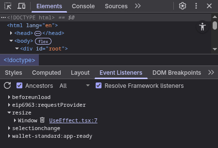

# Hvordan bruke useEffect

> [!NOTE]
> Du kan finne mer utfyllende informasjon om useEffect api og eksempler på [react.dev](https://react.dev/reference/react/useEffect)

`useEffect` er den mest brukte måten å oppnå `Effects` på i React, dette er en innebygd `hook` (funksjon) vi kan bruke for å hente inn informasjon eller synkronisere til andre systemer.

## Initialisering

Vi begynner med å importere `useEffect` fra React biblioteket

```tsx
import { useEffect } from "react";
```

Vi kan så kalle denne funksjonen inni komponentet vårt for å forklare hva vi ønsker `Effect`'en skal gjøre. Denne effekten kommer da til å kjøre etter komponentet har `rendret` og sørge for at det oppdaterer seg med den nye koden som vi har spesifisert. `useEffect()` tar i mot to argumenter

- En funksjon som kjører logikken vi definerer
- Optional: En liste over [dependencies](#dependency-liste) som bestemmer når `useEffect` skal kjøres

```ts
// Vi kaller useEffect med useEffect(function, dependencies)
useEffect(() => {
  // Vår logikk
}, []);
```

Når vi skal bruke `useEffect` ligger vi den inni komponentet vårt som dette, da blir useEffect kallet når komponentet har `rendret` ferdig, dette fører til en `update` av komponentet med den nye dataen.

```tsx
import { useEffect } from "react";

function MyComponent() {
  useEffect(() => {
    // Vår logikk
  }, []);

  return <div>...</div>;
}
```

## Dependency-liste

Vi kan ta kontroll over når ofte `useState` skal kalles ved å definere en avhengighetsliste, vi gjør dette ved å endre det andre argumentet (avhengighetslisten) i funksjonen. I eksempelet under kan du se de 3 alternativene vi har

```ts
// Her har vi droppet avhengighetslisten, denne Effekten kjører etter hver render. Pass på infinite loops!
useEffect(() => {});

// Her har vi en tom avhengighetsliste, denne Effekten kjører kun på mount
useEffect(() => {}, []);

// Her har vi definert variabler i avhengighetslisten, denne Effekten kjører hver gang komponentet mounter og når en variabel har endret seg
useEffect(() => {}, [variabel, variabel2]);
```

Hvis du ønsker at komponentet ditt skal kun kjøre `useEffect` hvis en prop eller state har endret seg kan du skrive det som dette

```tsx
function MyComponent({ name }: { name: string }) {
  const [count, setCount] = useState<number>(0);

  useEffect(() => {
    // Siden vi har lagt til name og count i avhengighetslisten så vill useEffect
    // bli kallet hver gang en av variablene endrer seg. Dette er nødvendig hvis du
    // ønsker å bruke de variablene i logikken inni useEffect. F.eks:
    console.log(name, count);
  }, [name, count]);

  return <div>...</div>;
}
```

> [!WARNING]
> Avhengighetslisten må inneholde alle verdier du bruker inni Effekten din.

Du kan ikke "velge" avhengighetene dine fordi avhengighetslisten må inneholde alle reaktive verdier du leser i effekten. Linteren håndhever dette. Noen ganger kan det føre til problemer som uendelige løkker eller at effekten re-synkroniseres for ofte. Ikke løs disse problemene ved å undertrykke linteren! Prøv heller dette følgende løsninger:

- Sjekk at effekten representerer en uavhengig synkroniseringsprosess. Hvis effekten ikke synkroniserer noe, er den kanskje [unødvendig](https://react.dev/learn/you-might-not-need-an-effect). Hvis den synkroniserer flere uavhengige ting, [del den opp](https://react.dev/learn/lifecycle-of-reactive-effects#each-effect-represents-a-separate-synchronization-process).
- Hvis du vil lese siste verdi av props eller state uten å «reagere» på den og re-synkronisere effekten, kan du splitte effekten i en reaktiv del (som blir igjen i effekten) og en ikke-reaktiv del (som du trekker ut i noe som kalles en Effect Event). Les mer om å [skille Events fra Effects](https://react.dev/learn/separating-events-from-effects).
- Unngå å være avhengig av objekter og funksjoner som dependencies. Hvis du oppretter objekter og funksjoner under rendering og leser dem fra en effekt, vil de være nye ved hver render. Det gjør at effekten re-synkroniseres hver gang. Les mer om å [fjerne unødvendige avhengigheter fra effekter.](https://react.dev/learn/removing-effect-dependencies)

## Opprydding

Opprydding er en viktig del av en `Effect`s livssyklus. Tenk deg at du bruker `useEffect` til å ligge til mange EventListeners ([w3](https://www.w3schools.com/js/js_htmldom_eventlistener.asp)/[mdn](https://developer.mozilla.org/en-US/docs/Web/API/EventTarget/addEventListener)) på et element. Siden et komponent kan kjøre `useEffect` mange ganger i løpet av en side kan du møte på en situasjon hvor et element har fått tildelt mange duplikater av samme event eller at eventen fortsetter selv etter komponentet har `unmountet` og ikke lengre vises. Ta eksempelet under

```tsx
function MyComponent() {
  const [w, setW] = useState(window.innerWidth);

  useEffect(() => {
    function onResize() {
      setW(window.innerWidth);
    }

    // Vi ligger til en event listener
    window.addEventListener("resize", onResize);
  }, []);

  return <p>Bredde: {w}px</p>;
}
```

I Nettleseren kan jeg se at EventListener nå er tilkoblet `<head>` elementet og følger med på `resize` hendelsen.



Ulempen er at det er ingen mulighet å fjerne denne EventListeneren hvis vi ikke trenger den lengre. Dette kan vi fikse ved å ligge til en retur på arrow funksjonen vår inni `useState`

```ts
useEffect(() => {
  function onResize() {
    setW(window.innerWidth);
  }

  window.addEventListener("resize", onResize);

  // Oppryddings funksjon
  return () => window.removeEventListener("resize", onResize);
}, []);
```

React vill kjøre oppryddings funksjonen hver gang en Effekt skal kjøres på nytt (ved `update`) og når komponentet skal fjernes (`unmount`) slik at komponentet trygt kan bli brukt på nytt senere

## Vanlige feil

#### Uendelig løkker

Glemmer å spesifiserer avhengighetslisten

```ts
// ❌ Kjører hele tiden
useEffect(() => {
  setCount(count + 1);
});

// ✅ kun når prop endres, og kun hvis ny verdi er ulik
useEffect(() => {
  setCount((c) => (c === someProp ? c : someProp));
}, [someProp]);
```

#### Mangler cleanup for timere/lyttere

Glemmer opprydding

```ts
// ❌ Event listener kjører konstant
useEffect(() => {
  function onResize() {
    /* ... */
  }

  window.addEventListener("resize", onResize);
}, []);

// ✅ Event listener blir fjernet når den ikke er nødvendig lengre
useEffect(() => {
  function onResize() {
    /* ... */
  }

  window.addEventListener("resize", onResize);
  return () => window.removeEventListener("resize", onResize);
}, []);
```

#### Bruker effekt for å transformere data som kan beregnes i render

```ts
// ❌ Effekt for filtrering:
useEffect(() => setFiltered(all.filter(f)), [all, f]);

// ✅ Beregn i render:
const filtered = all.filter(f);
```

#### Bruker effekt til brukerhendelser

Ikke bruk `useEffect` hvis du istedet kan bruke et element sitt `onClick`, eller annen, event håntering.

```tsx
// ❌ effekten vet du ikke hvilken knapp som ble klikket
useEffect(() => {
  console.log("clicked")
}), []);

// ✅ Gjør sideeffekten i selve event-handleren
<button onClick={() => { console.log("clicked") }}>
```

#### Data transformasjon

Hvis du f.eks har et objekt som består av flere key-value pairs og du ønsker å sitte de sammen for å vise mer kompleks data, gjør dette heller i komponentet sin JSX kode

```tsx
// ❌ Unødvendig state og effect
export function UserList({ users }: { users: User[] }) {
  const [formattedUsers, setFormattedUsers] = useState<string[]>([]);

  useEffect(() => {
    setFormattedUsers(
      users.map((user) => `${user.firstName} ${user.lastName}`)
    );
  }, [users]);
  return (
    <div>
      {formattedUsers.map((user) => (
        <p>...</p>
      ))}
    </div>
  );
}

// ✅ Gjør nødvendig formattering i JSX
export function UserList({ users }: { users: User[] }) {
  const [formattedUsers, setFormattedUsers] = useState<string[]>([]);

  return (
    <div>
      {formattedUsers.map((user) => (
        <p>{`${user.firstName} ${user.lastName}`}</p>
      ))}
    </div>
  );
}
```

## Kort oppsummert

- I motsetning til hendelser, skyldes effekter som følge av selve rendering, ikke en bestemt brukerinteraksjon.
- Effekter lar deg synkronisere en komponent med et eksternt system (tredjeparts-API, nettverk, DOM osv.).
- Som standard kjører effekter etter hver `render` (inkludert den første).
- React hopper over effekten hvis alle avhengighetene har samme verdier som ved forrige render.
- Du kan ikke "velge" avhengighetene dine, de bestemmes av koden inne i effekten.
- En tom avhengighetsliste (`[]`) tilsvarer at komponenten mountes (legges til på skjermen).
- I Strict Mode monterer React komponenter to ganger (kun i `npm run dev` ikke `npm run start`) for å stressteste effektene dine.
- Hvis effekten ryker på grunn av `remount`, må du implementere en cleanup-funksjon.
- React kaller cleanup-funksjonen før effekten kjører neste gang, og under `unmount`.
